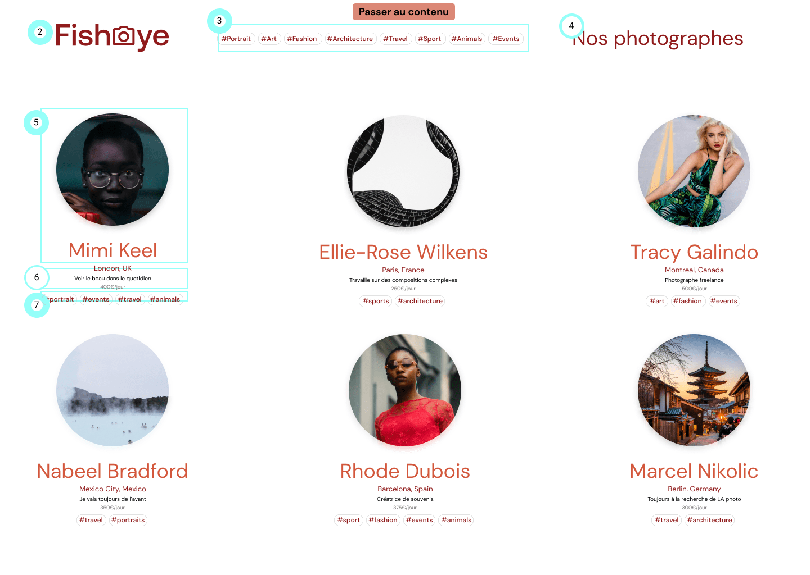

# Projet n°6 parcours frontend

### openclassrooms

## Mission : intégration avec du contenu dynamique Client

FishEye est un site web qui permet aux photographes indépendants de présenter leurs meilleurs travaux.

## Compétences évaluées :

- [x] Développer une application web modulaire avec des design patterns
- [x] Assurer l'accessibilité d'un site web
- [x] Écrire du code JavaScript maintenable
- [x] Gérer les événements du site avec JavaScript

## Run

eslint test :

- 1. `cd eslint` + `npm test`
- 2. ou depuis root `npm run lint`

JSON Server

- 1. `npm run server`
     http://localhost:3000/photographers
     http://localhost:3000/media

autoprefixer - postcss - postcss-cli

- 1. `npm run prefix`

**nota** : `node v14.18.0` avec `nvm use 14`

[LIEN REPO GITHUB](https://github.com/git504/Git504_01102021_FishEye)

